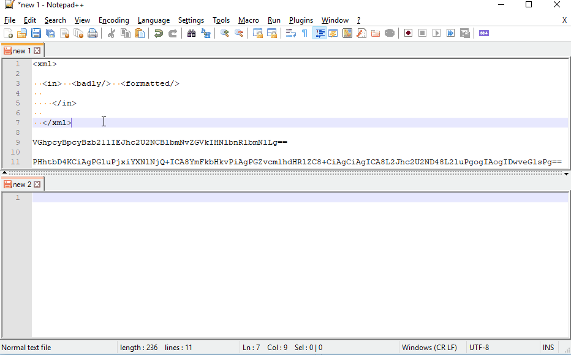
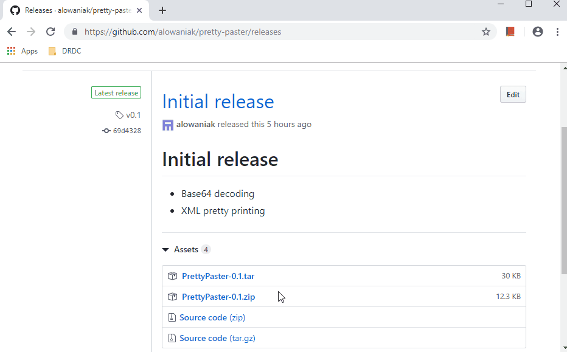

# Pretty Paster
A tool to pretty print/decode clipboard content.

## ToC
- [Usage](#usage)
- [Features](#features)
  - [Base 64](#base-64)
  - [Xml](#xml)
- [Installation](#installation)

## Usage
While you've got PrettyPaster running just copy&paste away! ☺️  

## Features
### Base 64
Decodes content that's _relatively likely_ to be base64 encoded.  
Considers content to be _likely_ base64 if it
 - Has a length of at least 50 characters 
 - Only contains base64 characters (obviously)
 - Is valid/mappable UTF-8 when decoded

### Xml
Pretty-prints xml (~~if, God forbid, you have to use it~~) by placing linebreaks after tags and indenting with 2 spaces per level.

### Json
Pretty-prints json by placing linebreaks after elements and indenting with 2 spaces per level.

## Installation
Simply download the "[.zip](https://github.com/alowaniak/pretty-paster/releases/download/v0.1/PrettyPaster-0.1.zip)" or "[.tar](https://github.com/alowaniak/pretty-paster/releases/download/v0.1/PrettyPaster-0.1.tar)" file from the [release page](https://github.com/alowaniak/pretty-paster/releases/tag/v0.1) and extract to a location of your choosing.  
Start PrettyPaster by running one of the startscripts in the "bin" folder.  
  
